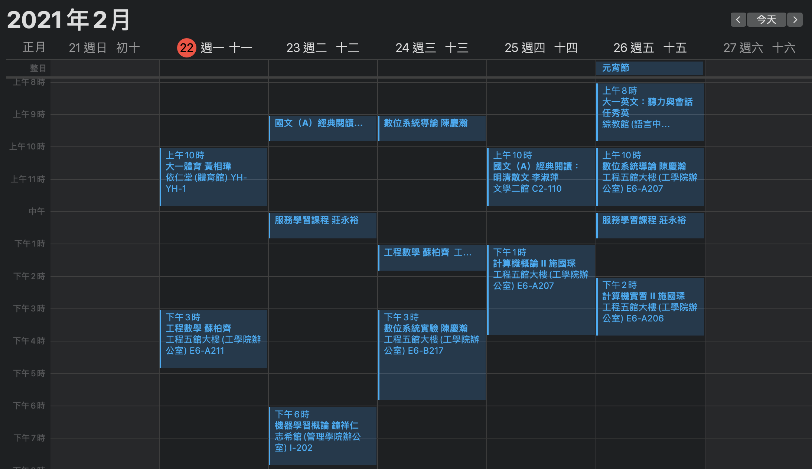

# NCU 課表 轉 .ics file tool

## Intro

為避免剛開學搞不清楚上課教室和上課時間，也方便自己日後管理行程，

所以做了這個工具，將課表以ics格式輸出，並匯入我的手機行事曆

如此一來就能清楚地看到課表，而且還能在上課20分鐘前收到通知~

## Beautiful Sample

You can download ics in **/sample** to demo the final product


- Demo on macOSX


- Demo on ios (jailbreak and install Kalm)

## requirement

python 3.5+

```bash
pip install icalendar

pip install request

pip install pandas
```

## Usage

**Step 0**: Push download button to download(clone) my repo's zip file then unzip it

or

```bash
git clone https://github.com/lebr0nli/ncu-schedule2ics.git
```

**Step 1**: 設定**config.ini**

```ini
[login]
username = 109502567(your student id here)
password = flag{D0nt_h4Ck_m3_if_y0u_cAn}(your password here)

[start_time]
year = 2021
month = 2
day = 21

[end_time]
year = 2021
month = 6
day = 28

[announcement]
announce_time = 20
```

Note:

**[login]** : 學號/portal密碼

**[start_time]** : 開學日

**[end_time]** : 放假日

**[announcement]** : 設定行事曆app的提醒時間(在課程開始前X分鐘發送提醒通知)


請按需求設定，帳號密碼也請確認是否正確填寫

**Step 2**: run python script

```bash
python main.py
```

產生在同目錄底下的```my_schedule.ics```，即是你的課表

**Step 3**: import .ics to your device

Some good tutorial :

**ios** : [good solution on stackoverflow](https://stackoverflow.com/a/65717748)

**mac** : just click ```my_schedule.ics```

**android** : 用任何方式將ics傳到手機上，即可匯入google calendar或支援ics的行事曆軟體

## Outro

Dirty code :(

Feel free to issue!
